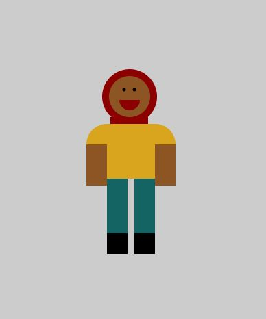

### A Portrait

I created a portrait using Processing:



The difficulties that I faced mostly have to do with typing out the shape name and parameters for every single shape used, and also with figuring out the coordinates. It didn't strike me then, but it does now -- I could've just used ```mouseX``` and ```mouseY``` to figure out the coordinates.

