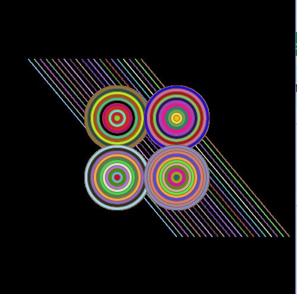

### More Circles but With Lines

I wanted to build on the previous artwork (someCirclesMeet) I created using Processing, and advance from it. Below is a screenshot:

This a link to the video: https://youtu.be/J9DTlAZBUGs

This took a very long time to make. I spent way too much time figuring out the functions. I was trying to make concentric triangles for the longest time, but it wouldn't work at all -- so I grew tired of it and tried out lines instead. I think most of my time was spent just stuck on the triangles problem. Figuring out the circles was time-consuming too, but they worked finally!

I really like how disorienting the artwork is, but I would really like to move on to more advanced shapes. 

