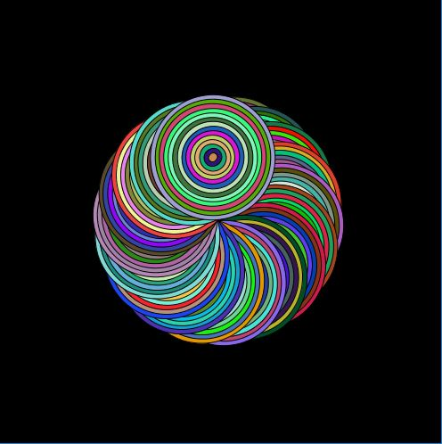

### Moving Circles

This is a screenshot of my artwork using transformations and classes:

I'm beginning to find working with classes challenging. It took me a while to figure where to insert different lines of code in order to attain the desired result. I still haven't figured out one more feature I wanted to incorporate (each color in each concentric ring should change with time too). Using transformations were also challenging, especially figuring out the placement of the circles. 

